# Easy State Documentation

-------

## Table of Contents

- [Easy State Documentation](#easy-state-documentation)
  - [Table of Contents](#table-of-contents)
  - [Introduction](#introduction)
  - [Lexicon](#lexicon)
    - [Context Wizard Terms](#context-wizard-terms)
    - [Designer Terms](#designer-terms)
    - [Finite State Machine Terms](#finite-state-machine-terms)
  - [1.Editors](#1editors)
    - [1.1 Designer](#11-designer)
      - [Getting Around the Designer](#getting-around-the-designer)
      - [Design Options Panel](#design-options-panel)
    - [1.2 Context Wizard](#12-context-wizard)
      - [Options](#options)
  - [2 Using EasyState in Your Game](#2-using-easystate-in-your-game)
    - [Easy State Machine Component](#easy-state-machine-component)
    - [Event Handlers](#event-handlers)
    - [Easy Refresher](#easy-refresher)
    - [EasyState Database](#easystate-database)
  - [3 Tutorials](#3-tutorials)
    - [General Workflow](#general-workflow)
    - [Build Your First State Machine in 5 Minutes](#build-your-first-state-machine-in-5-minutes)
      - [Steps](#steps)
      - [Where to Go from Here](#where-to-go-from-here)

-------

## Introduction

Easy State is a simple and extensible visual state machine editor. It provides the framework to quickly sketch out complicated behaviors. If you want to learn about the system from the ground up read on! But if you want to jump right in and get your hands dirty I recommend jumping straight to the [Tutorials](#3-tutorials) section.You can also refer to the included quick reference image for a run down on what the different nodes do and answer common question.For the latest documentation go to the github documentation [website](https://thepigeonfighter.github.io/EasyState/). Check out the [Youtube](https://www.youtube.com/channel/UCqpzOtqr6FiJ6LOBzW5sJSQ) channel for video tutorials.

## Lexicon

Here is a list of common words and their meanings in the EasyState universe.

### Context Wizard Terms

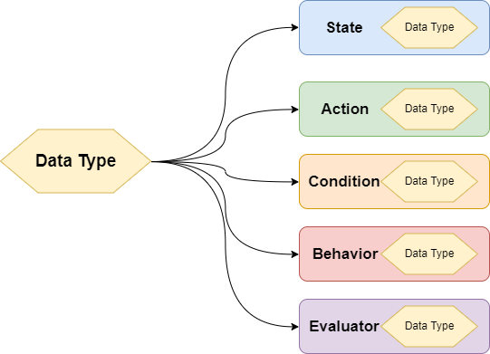

`DataType`
In essence a data type is just a data container. Think of it like a blue print for your state machine. The way Easy State is designed each state machine is strongly typed by the `DataType` you create. If that doesn't make sense right now don't worry, it will later.

`Action`
This defines what your state machine does. If your state machine needs to increment a score or tick a timer it should be done inside of an `Action`.

`Condition`
Conditions dictate the flow of your state machine. They must always either evaluate as true or false.

`Evaluator`
Evaluators are used when you would rather score a transition instead of return a simple true or false. These will be described more in the [FSM Terms section](#finite-state-machine-terms). They can only be used by Utility Nodes, more on that later.

-------

### Designer Terms

-------

`Designer`
The Designer is an Unity Editor window that you will use to create and edit behaviors.

`Design`
A design is a snapshot of the Designer at a given time. Designs are essentially un-validated behaviors. As such they need to be converted into behaviors before they can be used by an Easy State Machine component.

`Node`
A general term that refers to any representation of a state in the Designer. There are currently four types of nodes in EasyState:

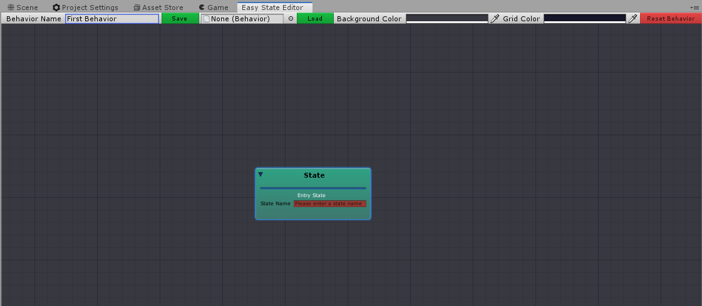

- **Entry Node(Green)**
  This is the first node of any design. Every behavior will start its execution at the entry state and progress from there. Any Node that is not connected to another Node has an implicit connection to the Entry Node.

-------

- **State Node(Purple)**
  Think of the State Node as the default Node. They can contain one or more `Actions` and one or more `Connections`. A State Node will execute its actions and then evaluate its connections to 'decide' which node to go to next.

-------

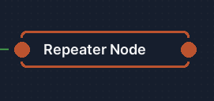

- **Repeater Node(Orange)**
  Repeater nodes can have `Actions` and must have at least one `Connection`. When a repeater node is entered it will execute its actions and then evaluate its connection. If the connection returns false it will yield an update cycle but not transition to next node. On the next update cycle the actions are executed again and the connection is evaluated again. This repeats until one of the connections evaluates as true. Only when this happens will the behavior transition into the next node.

-------

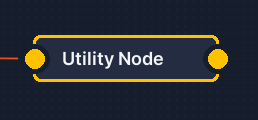

- **Utility Node(Yellow)**
  Utility nodes do not have any `Actions`. They must have one or more `Evaluators`. When an Utility node is entered all of the evaluators are evaluated(redundancy FTW) the behavior then transitions to the node that is connected to the evaluator with the highest score.

-------

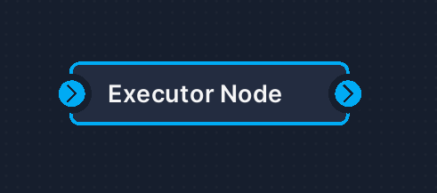

- **Executor Node(Blue)**
  Executor nodes can have many actions and zero or one transitions away from it. When an Executor node is entered each action in its list of actions will execute if the action's condition is met.

-------
`Connection`
Connects two states and most of the time will have a `Condition` or `Evaluator` connected to them. There are four kinds of connections in Easy State.

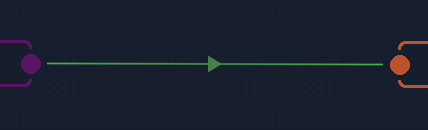

- **Unconditional**
The simplest of all connections it will always transition to their destination node no matter what.

-------

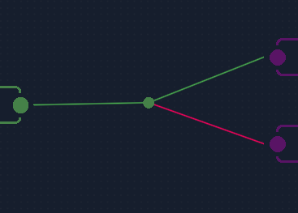

- **Default Connection(True Destination:Green,False Destination:Red)**
Default connections have a true destination and a false destination. If there are more than one default connections on a node then the connections will be given an implicit priority which is based on their position from top to bottom. So the connection that is at the top of the list will be evaluated first.

-------

- **Only If Connection(Orange w/Arrow)**
  Only If connections are used by `Repeater` nodes and only have a true destination. Their function is to only go to that connection if its `Condition` returns true.There can be multiples of these which have implicit top to bottom priority like default connections.

-------

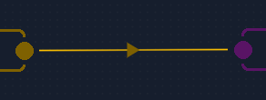

- **Evaluator (Yellow w/Arrow)**
Used by `Utility` nodes these connections have a single destination. The evaluator connection with the highest score is chosen as the destination. As with the only if and default connections, evaluators also have an implicit top to bottom priority.

-------

### Finite State Machine Terms

-------

`State Machine`
A state machine is loaded with an instance of the `DataType` that has been created and a `Behavior`. This is where the update cycle of the state machine is run.

`Behavior`
A behavior is just a collection of states with a single state that is marked as an entry state.

`State`
States have one or more `Actions` and a single `Resolver`. When updated by the state machine actions are executed then the resolver returns the next state to the state machine. Nodes of all types from the designer are converted into states.

`Resolver`
Resolver is an interface that covers all the possible types of transitions in Easy State. For performance reasons every `Connection` type from the designer has its own resolver implementation. All connections from the designer are converted into a resolver.

Check out [System Design](#2-System-Design) for more info on each of these components.

-------

## 1.Editors

-------

There are two main editor tools when using EasyState. The Designer is where you design your behaviors using the visual node editor. Then there is the Context Wizard which is used to create `DataTypes`, `Actions`,`Conditions`, and `Evaluators`. Both of these tools were designed to be as simple and efficient as possible without sacrificing flexibility.

### 1.1 Designer

-------

The window can be found under the 'Window/EasyState/Editor' tab at the top of Unity.The window is a draggable/dockable and behaves in the same way as other Unity windows like 'Scene' and 'Game' work.

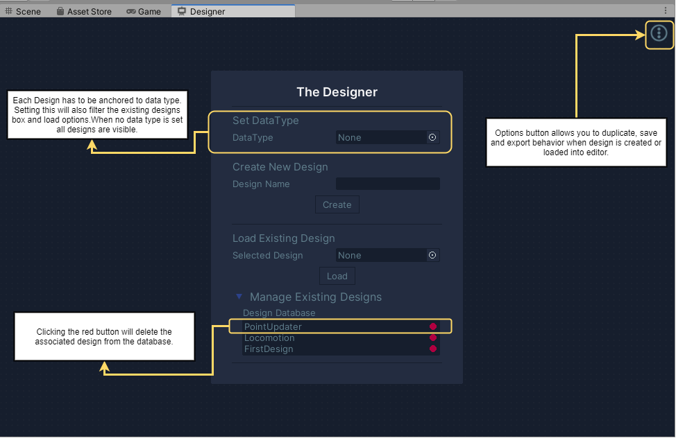

#### Getting Around the Designer

-------

This editor allows the user to pan and zoom. To pan left click on the background and drag. Left click to select a node and then left click and drag to move the node around the editor window. You can zoom the editor in and out by using either the mouse scroll wheel. To add nodes to the editor right click on the background. Doing so will open a context menu. Select 'Add Node' and it will create a node where your mouse is located.

#### Design Options Panel

-------

  
You can access this options menu by clicking the three dot button at the top right of the designer window, here you can do the following:

- Rename the current design.
- Convert the current design to a behavior which makes it available for use by Easy State Machine components outside the designer.
- Save the current design.
- Copy current design.

>Note: the symbols in parenthesis mark their corresponding shortcut key.

-------

### 1.2 Context Wizard

-------

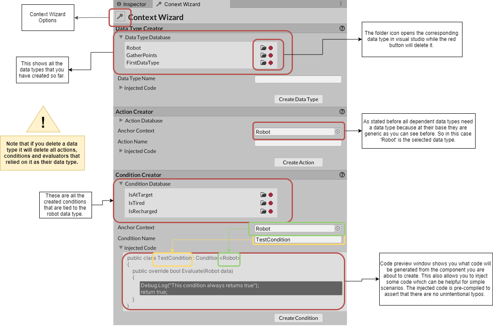  

The Context Wizard is used to make the Actions, Conditions, and Contexts. Actions and Conditions  require a Context. A Context holds the data that Conditions need to evaluate and the data Actions need to 'act' on.

#### Options

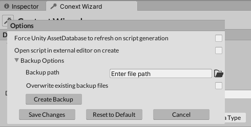  

There are only a few options for the context wizard. "Force Unity AssetDatabase Refresh refers to how Unity serializes and adds scripts to the project build. Generally you will notice when you create a new script in Unity there is a delay as your project recompiles. By default the Context Wizard will by pass this rebuild pushing it down the line allowing you to create multiple components without your Unity project recompiling. But if you would like to force a recompile every time you add a component to keep your project up to date you can tick this option. The "open script in external editor on create" is self explanatory. The only other note is that this enables the force refresh option if enabled. The reason for this is that the script needs to be added to the project before it will work in your external editor. It could work without a recompile but your external editor wouldn't recognize it as being part of the project yet. Lastly, there are some options for backing up your current database. This will create a copy of all generated scripts(except event handlers and data type instances which we will discuss later) as well as a copy of the SQLite database file into the selected directory. If a copy already exists in that directory this will cause the backup to fail, unless you have ticked the overwrite box. In which case it will replace the old files with the new files.  

-------

## 2 Using EasyState in Your Game

-------

### Easy State Machine Component

-------

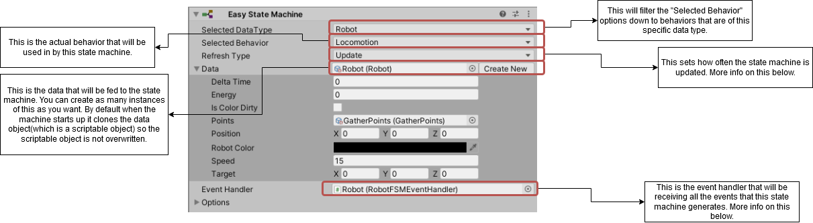

Above we have an example of the easy state machine component that is not in play mode. This view changes to the one below when the game has entered play mode.

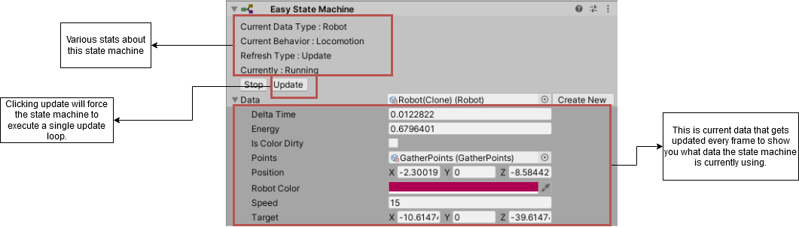

In this iteration of Easy State the goal was to make the Easy State Machines a self contained unit in which the user would not have to edit internals. This is why the component offers an array of options.

**Refresh Type**
There are currently seven different kinds of refresh types available to choose from:

- **None** as the name indicates this machine will never refresh unless explicitly told to. This could be useful for situations where you have a state machine that only updates under a certain circumstance like every time the player scores, but doesn't need to be wasting resources updating any other time.
- **Update,Fixed Update, Late Update** these will update every time those Unity methods are invoked.
- **Custom Refresh Rate** as the name says you can indicate an interval in seconds how often you want need your state machine to update.
- **Background Thread With Event Sync** this has a custom refresh cycle time  like the previous option the difference is the actual update is executed on a background thread. The events ARE called on the main thread so the data is safe to use on Unity objects. This is useful for expensive operations that you don't want blocking your main thread like path-finding. It is worth pointing out that this doesn't make path-finding any faster. In fact it will add some time to the operation. But it allows you to do something else while you wait for it to finish.
- **Background Thread** This works exactly like the above option except the events are NOT called on the main thread. This means the data may not transfer to Unity objects like one might expect so use with caution. On the other hand this is the more performant of the two options because the first option has to wait until the main thread has fired the events before processing where as this second option fire events and processes on the same thread.

**Options**

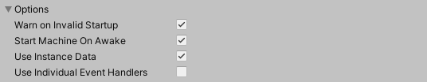

The above is a picture of the default options set on an easy state machine component.

- **Warn on Invalid Startup** logs a warning if the state machine fails to start for any reason.
- **Start Machine On Awake** starts the machine updating in the Awake  method.
- **Use Instance Data** makes a copy of the scriptable object's data and uses that instead of the original. This will probably be how you want most of your machines to run.
- **Use Individual Event Handlers** This dictates which event handler strategy this state machine will use. More on this in the next section.

-------

### Event Handlers

-------

This is the most important part of the easy state asset from a user's perspective. There are two different options. You can use individual event handlers or one single event handler that is responsible for responding to each event.
**Single Event Handler**

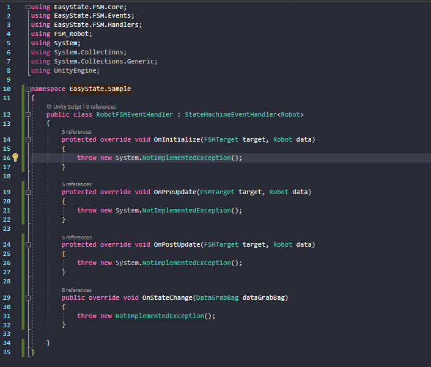  

Here is an example of a newly created template based on the `Robot` data type.

- **OnInitialize** gets called once when the machine is first started before the first update execution.
- **OnPreUpdate** called once prior to update execution.
- **OnPostUpdate** called once after the update execution is completed.
- **OnStateChanged** this gets called every time a state is changed which utilizes the `DataGrabBag` which is just a `Dictionary<string,object>` meant for dirty simple data communication.

**Multiple EventHandlers**
When you check the option "Use Individual Event Handlers" under the options foldout on the Easy State Machine component it will change the inspector for the Easy State machine.

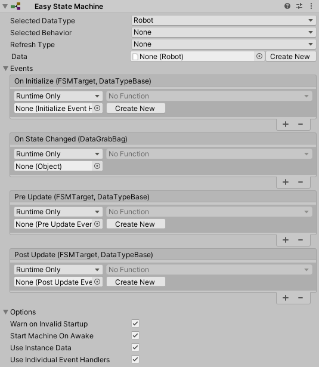

As you can see using individual event handlers breaks each of the events in the single event handler out into its own event. These events utilize Unity's built in events. The one thing to notice is that you can choose to create a event handler template for 3 of the 4 events. You can certainly create your own individual event handler but it needs to inherit from a particular abstract class for it to be allowed so it is often easiest just to use the "Create New" button that will create a template like the one below that implements the correct abstract class.

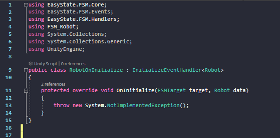

Notice that this inherits from `InitializeEventHandler<Robot>`. This is an abstract class that provides the `OnInitialize` method. The rest of the templates work in the same way. The `OnStateChange` event is less strict. It works like any other Unity Event and can have anything alerted on its invocation. The last thing to note about this is that there is a small performance loss that you incur when going the individual event handler route. I won't get into the 'why' but just be aware that it exists.

-------

### Easy Refresher

-------

This component is a singleton object that will be created at runtime if one does not already exist in the scene. The picture above shows the component while in Play Mode. When in play mode it displays various stats about how many state machines it is updating. Part of a state machine's initialization process is to register itself with this component. Once registered the Easy Refresher component orchestrates all the scheduled updates for all the state machines in the scene. This has various benefits the main one being that instead of 2000 `MonoBehavior`'s update methods being invoked you have one `MonoBehavior` that handles the update.

-------

### EasyState Database

-------
While using the Easy State you will generate an assortment of scripts and assets. By default they will all be stored in a folder that will be named EasyState Database. While using EasyState you will be unable to get rid of this folder.

>Deleting the root database folder is an effective way to reset your database. Obviously you will want to do that with caution.

  

As seen above the easy state database is broken into four categories plus the database file itself. In this example you can see we have three different data types. Therefore we have three different sub folders in each of the categories. One folder for each data type.

-------

## 3 Tutorials

-------

### General Workflow

In order to get started using EasyState the first thing you will want to do is open the "Context Wizard" editor window and define a data type.

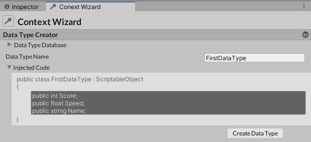  

 You can then use this data type to create designs in the "Designer Window".

 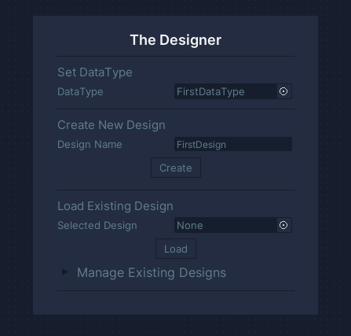

As needed use the Context Wizard to add actions and conditions to your state machine to flesh out your desired behavior.

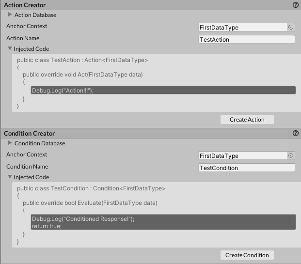

 Once you are satisfied with your design you can export your design as a behavior.

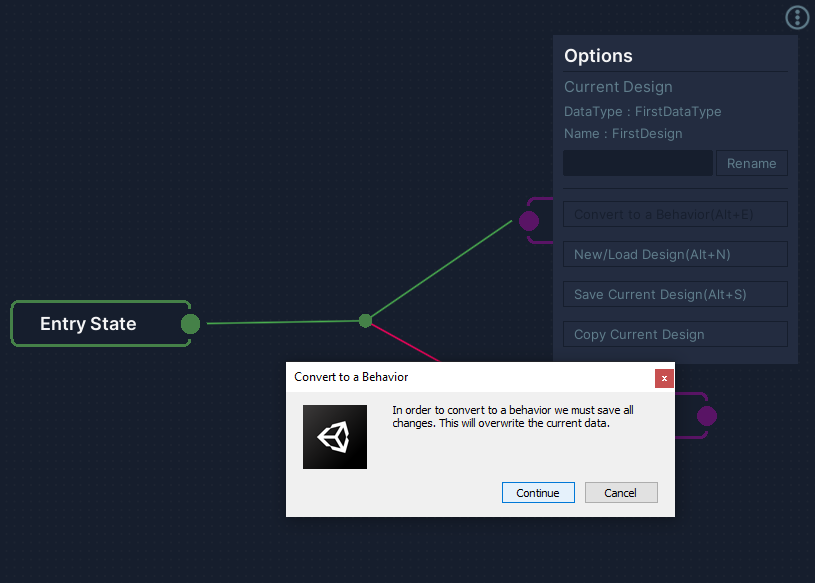

 Once it has been exported to a behavior it is now available to be used by the Easy State Machine Component. You then select the newly exported behavior and select the desired refresh rate.

 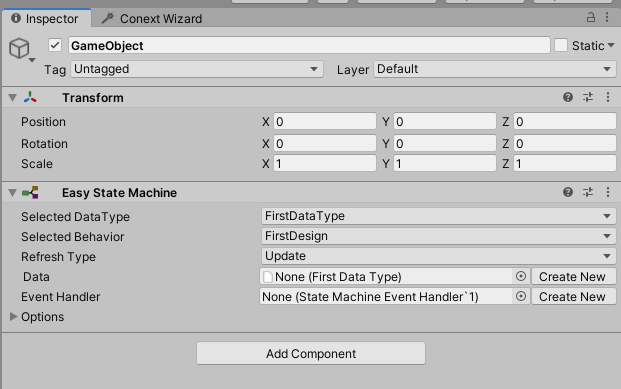

 Next you need to create or select an instance of the Data Type you want to use. In this example there wasn't one created so I just created one, and set some default values.

 

  After that the only thing that is left to do is to hook up an event handler. To do as much or little as is necessary for your particular use case. You can make one manually or just click the "Create New" button to have Easy State generate a template for you.

  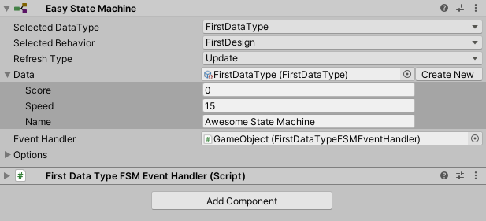
  
Now your behavior is ready to be run. You can make changes to the design in the designer and once the design is exported as a behavior those changes will automatically propagate to your Easy State Machine Components.

### Build Your First State Machine in 5 Minutes

In this tutorial will make the most basic state machine possible. A state machine that alternates between two states and logs messages to the console. This should help complete the above explanation of work flow.

#### Steps

- Open the Context Wizard Window(Window/EasyState/Context Wizard). This will dock if possible next to your inspector tab.
- Create a data type. You can name it whatever you want. I will name mine "FirstDataType".
  
   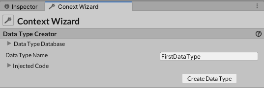

- Select "FirstDataType" (or whatever name you gave your data type) and create one action called "Hello" and inject the line of code `Debug.Log("Hello!!");` into the injected code foldout.
  
   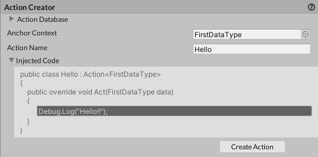

- Next with the same data type selected create another action and name it "Goodbye". Use the following line of code in the injected code foldout : `Debug.Log("Goodbye!!");`
  
  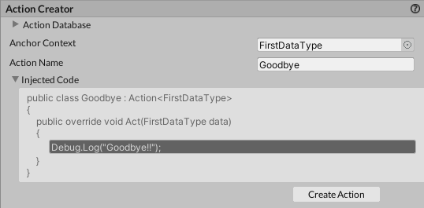
  
- Create a Condition tied to the same data type named "FiftyFifty". Use the following code:`return Random.Range(0f, 1f) > .5f;` this will effectively return true half the time and false the rest of the time.

  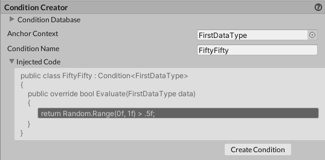
  
- Now that we have all the components we need open the Designer(Window/EasyState/Designer) and select your data type as the data type and create a design named whatever you want. I'll name mine "FirstDesign"(note: spaces can be in titles).
  
  
  
- Right click on the background of the Designer and add two state nodes.
  
  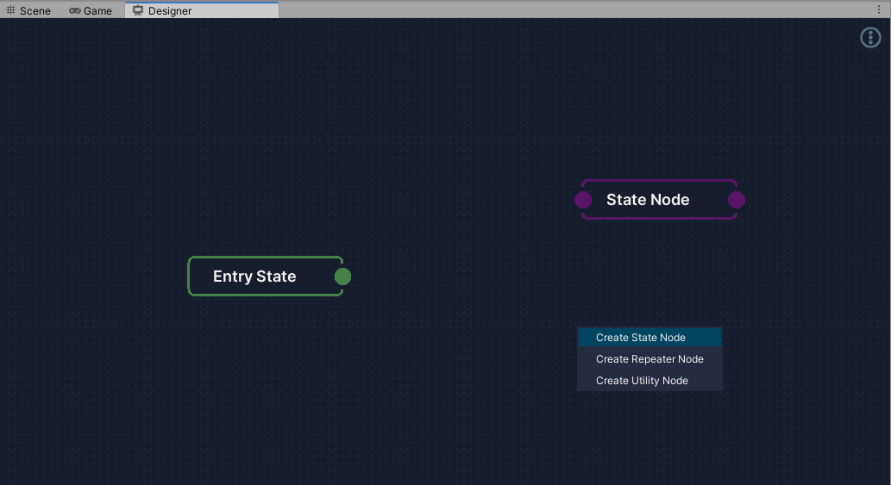
  
- Double click on the state nodes to bring up their details panel. Name one "Hello" and the other "Goodbye".
  
  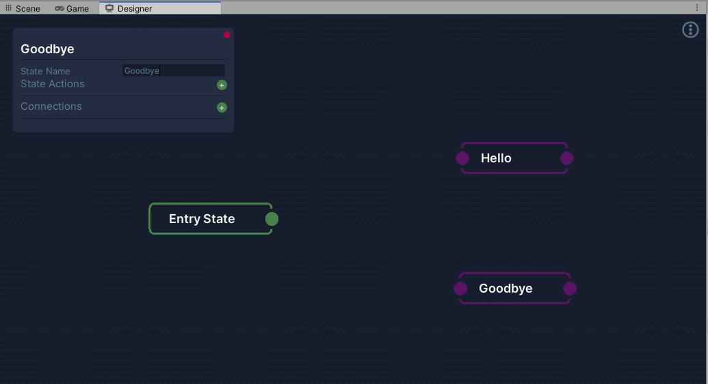
  
- Click the circular green button with the plus icon on the "State Actions" row to add actions to nodes. Add the "Hello" action to the "Hello" node and the "Goodbye" action to the "Goodbye" node.
  
  
  
- Click on the green circle on the right of the entry node.(This will initiate a connection) With connection initiated click on the "Hello" state to make the connection.
  
  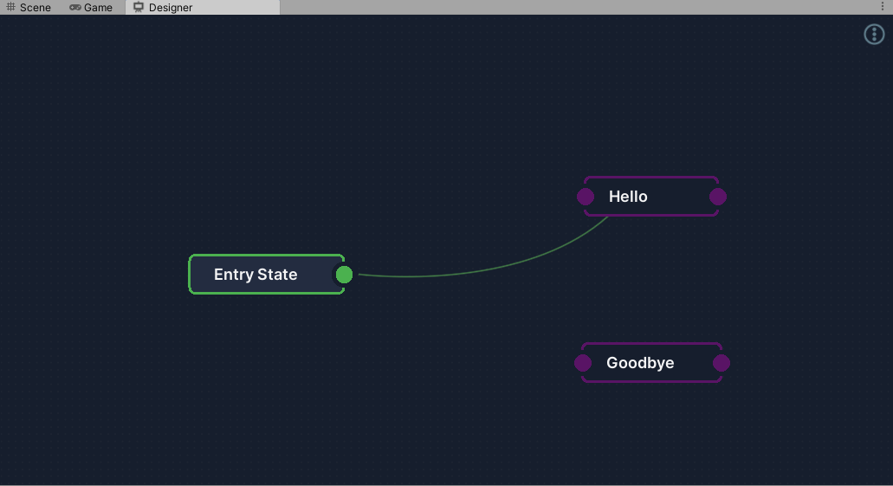
  
- Double click on the entry node to open its details panel. Set the condition to "FiftyFifty"
  
  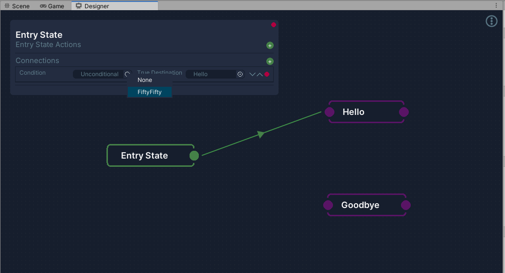
  
- Set the false destination to "Goodbye"
  
  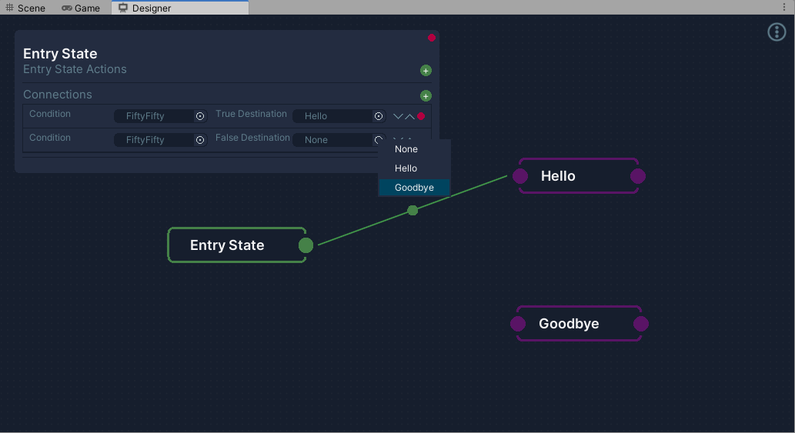
  
- Click the three dot button at the top right of the designer to open the options panel and click the "Convert to Behavior" button. Confirm the dialogue box and you should receive a message that the design was saved and the behavior converted. 
  
  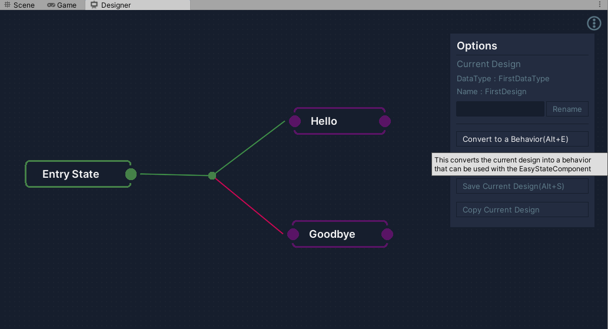
  
- In a new scene add an empty gameObject and on the object at an `EasyStateMachine` component. You can search for it or it will be under PigeonStudios/EasyState/Easy State Machine.
  
  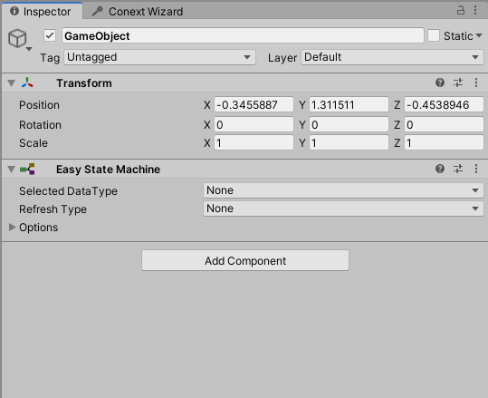
  
- Select the data type you created and the name of the design you created. You can set the refresh type to whatever you want.
- Create some data by clicking the "Create New" button name it and save it somewhere.
- Create an event handler as well. We will not be needing it for this particular state machine but Easy State requires one to work. Create one by clicking the "Create New" button and saving it somewhere. It will automatically add itself as a component to the gameObject. 
  
  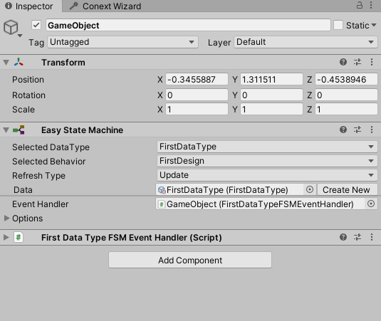
  
- After the project has recompiled open the Event Handler scripts and remove the "Not Implemented Exceptions" since we will not be doing anything with those events for this state machine.
  
 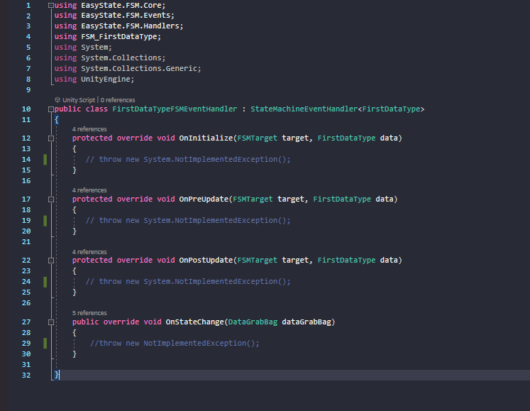
  
- Click play and you should be seeing alternating messages on the console!
  
  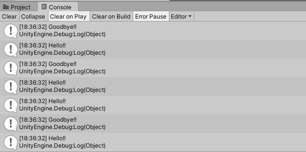
  

#### Where to Go from Here

Congratulations on your first operating state machine. From here you can fiddle around with various settings like refresh type. Maybe use the event handler to respond to different points in the update cycle. You can also examine the Robot Example project to see how more complicated systems interact with each other in a non trivial example. There will be some video tutorials posted on [Youtube](https://www.youtube.com/channel/UCqpzOtqr6FiJ6LOBzW5sJSQ) where you can find a video version of the above tutorial and more.
>Note: Video tutorials will refer to this as EasyState v2. The other tutorials are for older versions of Easy State.
