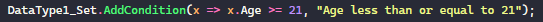
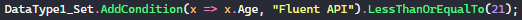
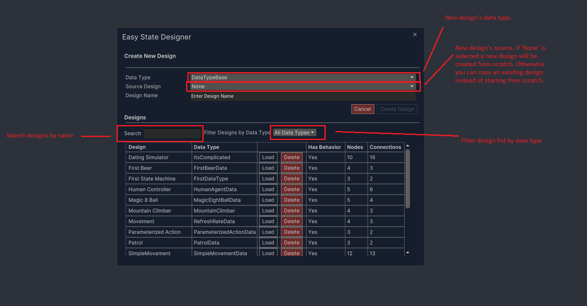

# Easy State Documentation


-------

## Table of Contents

- [Easy State Documentation](#easy-state-documentation)
  - [Table of Contents](#table-of-contents)
  - [Introduction](#introduction)
  - [Lexicon](#lexicon)
    - [Core Components](#core-components)
      - [`DataType`](#datatype)
      - [`Action`](#action)
      - [`Parameterized Action`](#parameterized-action)
      - [`Condition`](#condition)
      - [`Evaluator`](#evaluator)
    - [Designer Terms](#designer-terms)
      - [`Designer`](#designer)
      - [`Design`](#design)
      - [`Node`](#node)
      - [`Connection`](#connection)
      - [`Update Cycle`](#update-cycle)
  - [1. Editing](#1-editing)
    - [1.1 Creating Core Components](#11-creating-core-components)
      - [Create Components via Asset Menu](#create-components-via-asset-menu)
      - [Create Components Inside Data Data Type](#create-components-inside-data-data-type)
      - [Inheritance](#inheritance)
      - [Tips](#tips)
    - [1.2 Designer](#12-designer)
      - [Controls](#controls)
      - [Getting Started](#getting-started)
      - [Nodes](#nodes)
        - [Node Settings Foldout](#node-settings-foldout)
        - [Node Description Foldout](#node-description-foldout)
        - [Actions Foldout](#actions-foldout)
        - [Connections Foldout](#connections-foldout)
        - [Summary Foldout](#summary-foldout)
      - [Connections](#connections)
      - [Groups](#groups)
      - [Notes](#notes)
      - [Jumper Node](#jumper-node)
      - [Designs vs Behaviors](#designs-vs-behaviors)
  - [2. In Unity](#2-in-unity)
    - [2.1 Easy State Machine](#21-easy-state-machine)
      - [Settings](#settings)
      - [Easy State Machine Component in Play Mode](#easy-state-machine-component-in-play-mode)
    - [2.2 Event Handlers](#22-event-handlers)
    - [2.3 Easy Refresher](#23-easy-refresher)
    - [2.4 Debugger Window](#24-debugger-window)
      - [Format Data Popups](#format-data-popups)
  - [3. Misc](#3-misc)
    - [3.1 Settings](#31-settings)
    - [3.2 Data](#32-data)
    - [3.3 Easy State v3 vs Easy State v2](#33-easy-state-v3-vs-easy-state-v2)
    - [3.4 FAQ](#34-faq)
      - [Why is there a Newtonsoft dependency?](#why-is-there-a-newtonsoft-dependency)
      - [How should I work with Easy State Machine data?](#how-should-i-work-with-easy-state-machine-data)
      - [How should I use the Single Event Handler?](#how-should-i-use-the-single-event-handler)
      - [How can I get a reference to the state machine's data instance in Unity?](#how-can-i-get-a-reference-to-the-state-machines-data-instance-in-unity)
      - [IL2CPP](#il2cpp)
    - [3.5 Built In Components](#35-built-in-components)
      - [Always True Condition](#always-true-condition)
      - [Log Message Action](#log-message-action)
  - [4. Tutorials](#4-tutorials)
    - [General Workflow Overview](#general-workflow-overview)
    - [Create Your First State Machine](#create-your-first-state-machine)
      - [Steps](#steps)
    - [Patrol Tutorial](#patrol-tutorial)
      - [Steps](#steps-1)
    - [Where to Go from Here](#where-to-go-from-here)

-------

## Introduction

Easy State at its core is a programmer centric visual state machine editor. It tries to take care of all the repetitive code that comes with handling state machines but allow the programmer the most flexibility possible. As such, Easy State is more than a strict state machine as it also allows behavior tree like designs as well as utility based nodes. With the 3rd version of this tool Easy State has gotten an upgrade incorporating many quality of life changes and user suggested features yielding the most powerful flexible Easy State version yet. To get a quick overview jump to the [General Workflow Overview](#general-workflow-overview) section.

## Lexicon

Here is a list of common words and their meanings in the EasyState universe.


### Core Components


#### `DataType`

In essence a data type is just a data container. Think of it like a blue print for your state machine. The way Easy State is designed each state machine is strongly typed by the `DataType` you create. If that doesn't make sense right now don't worry, it will later. All data types inherit from `DataTypeBase`. `DataTypeBase` comes with a couple fields that are of interest.

- DataGrabBag
   A generic data container used for passing raw data into and out of the state machine.
- FSM_GameObject
GameObject that this state machine is attached to.
- FSM_Transform
Transform that this state machine is attached to.

> Data Type support inheritance. Meaning that actions/conditions/evaluators that you define on a base class will be available for sub classes.

When you create a data type the will be an additional field added to the template of type `DataTypeFunctionSet` this field can be renamed and is used to define Actions,Conditions and Evaluators in line instead of in a separate file. More on this later.

#### `Action`

This defines what your state machine does. If your state machine needs to increment a score or tick a timer it should be done inside of an `Action`.

#### `Parameterized Action`

Parameterized Actions inherit from `Action`. They add the ability to pass a primitive argument straight from the design to an action. In order to use them create a 'Parameterized Action' from the Asset Menu. Then replace the placeholder 'TParameterType' with your desired parameter type. Currently supports int, float, string, and boolean parameter types.

#### `Condition`

Conditions dictate the flow of your state machine. They are boolean and therefore always evaluate as true or false.

#### `Evaluator`

Evaluators are used when you would rather score a transition instead of returning a simple true or false. This can be useful when trying to decide between more than two possibilities.

>Note: DataTypes, Actions, Conditions, and Evaluators that are file based can be renamed. Their `EasyStateScript` attributes must not be altered. Inline components can also be renamed, but any references that exist to those components inside a design will be lost.

-------

### Designer Terms

-------

#### `Designer`

The Designer is an Unity Editor window that you will use to create and edit designs.

#### `Design`

Designs are created in the Designer. A design defines a graph of nodes and connections that can be translated into a behavior to be consumed in Unity if the design is valid.

#### `Node`

A node or state references a point in the design graph where actions can be executed or update cycles delayed before traversing to the next node.

#### `Connection`

Connects two states or nodes together. There are two types of connections.

- Conditional Connections
  Rely on `Condition` types as defined in the above core component section to decided whether or not the connection can be traversed.
- Evaluator Connections
  Rely on `Evaluator` types as defined in the above core component section. Each connection returns a score. The connection with the highest score is selected to be traversed.

#### `Update Cycle`

Refers to when a state machine is told to update. Typically the first time a state machine is told to update it will start by updating the entry node(first node of the design) and continuing to update nodes until it updates a node that has a cycle type that is not `Pass Through`([more on this](#node-settings-foldout)) or a node that is a leaf node. Leaf nodes automatically loop back to the entry node after being updated. A full graphical representation is located in the same folder as the documentation.

-------

## 1. Editing

-------

This section covers how to create components and use them inside the designer.

### 1.1 Creating Core Components

-------

#### Create Components via Asset Menu

Start off by creating a Data Type. To do this you can either open the Assets Menu and navigate to EasyState/New Data Type or alternatively right clicking in the Unity's Project window and navigating to EasyState/New Data Type.


When you click on the New Data Type button you will be presented with a File Explorer popup to allow you to select where you want to save the new Data Type file. Once a location has been selected Easy State will generate two files.

- {Data Type Name}.cs
    This is the actual data type file that you can edit to add all the fields you want to expose to your state machines.
- {Data Type Name}.asset
    This is a ScriptableObject instance of your data type. This is used by the Easy State Machine component in your Unity Scene.
- {Data Type Name}StateMachine.cs
    This is the State Machine component you will use to utilize any designs you create that use this data type. It is a Unity component and can be added to gameObjects.

Once created the new Data Type will be added to the Easy State Assets menu list. In the image above we have created a Data Type called `TestData`.
You will notice this menu allows you to create Actions, Parameterized Actions, Conditions, and Evaluators for particular Data Types.


>Note: Easy State scans Unity's Assemblies for newly added core components. As such you can rename or delete generated scripts as you please but you should not edit the `[EasyStateScript]` attribute, as this is how the framework keeps track of which components have been added/moved/or deleted. Additionally be aware that deleting components can invalidate designs and thereby delete their associated behaviors that may be being used by Easy State Machine components in your Unity Scene.

#### Create Components Inside Data Data Type

You can add components to a data type by adding components directly to the `DataTypeFunctionSet` inside of the Data Type file inside the constructor. There are several key methods to add functions or component to a Data Type's set.

`Actions`
You can add actions to the set by utilizing the `AddAction` method. This method requires an `Action<T>` where `T` is the Data Type and a unique name for the action.


There is also an `AddLoggingAction` method that makes it easy to create logging actions for diagnostic purposes.

`Conditions`
There are multiple ways to add conditions to a set. If a field or property is of type `bool` it will be automatically added to the function set and will be able to be used in the designer.


You can also define a conditional function using the `AddCondition`



Or use a fluent API approach:



There are a few fluent API methods available to make simple comparison fast and easy to read.

`Evaluator`
Evaluators can be added by using the `AddEvaluator` method. This method requires a `Func<T,float>` where `T` is the Data Type being used and the float that is returned is the score your evaluator yields. This method also requires a unique evaluator name.


#### Inheritance

Inheritance is supported! This means that if you inherit from a Data type that you created, all the actions, conditions, and evaluators will be able to be used from the parent data type in the designer.

#### Tips

- If you want to add or change default using statements in any of these templates, their text files can be found at Assets/EasyState/Editor/Templates
- Generated components like Actions or Conditions should be stateless. All the state should be contained in the Data Type object.
- You can rename set fields in Data Types to any name you'd like.
- Take care when naming components as clear and precise names will make your life easier inside the designer.
  
### 1.2 Designer

-------


The window can be found under the 'Window/EasyState/Editor' tab at the top of Unity.The window is a draggable/dockable and behaves in the same way as other Unity windows like 'Scene' and 'Game' work.

#### Controls

*Pan* : Ctrl + Left Mouse or Middle Mouse Button
*Zoom*: Mouse wheel
*Select*: Left Mouse
*Multi-Select* Left Click Background + Drag OR Ctrl + Left Click
*Open Element Details* : Double Left Click
*Drag Element* : Left Click Element + Drag
*Save* : Ctrl + S
*Context Menu* : Right Click
*Delete Element* : Del
*Duplicate Element* : Ctrl + D
*Rebuild Editor* : Ctrl + R
*Validate Design* : Ctrl + V
*Group Nodes* : Ctrl + G

#### Getting Started

When first opening the designer you will be greeted with a loader panel that allows you to manage your designs. Assuming you have created a Data Type already it should look something like this :



Once a design has been created your design will start off with an Entry Node already created. Entry nodes act as the starting point of all designs.


With the new design open you can start adding nodes by right clicking on the designer background and picking the node preset you want.

#### Nodes

When you right click the background of the designer you are greeted with a context menu that has by default six options.


The top 4 options are all just different node presets(More on these later). While the bottom two represent different node types completely. If we create a state node and double click on it, it will open the detail panel for the node.


##### Node Settings Foldout

When the settings foldout is expanded you will see that nodes have three dropdowns that greatly alter the behavior of the node.


- Condition Type
  This controls what types of exit connections this node will make.
  
  - Default([Conditional Connections](#connection))
  Can have one `AlwaysTrue` connection to another node. If there are more than a single connection or the single connection is not an `AlwaysTrue` connection than a fallback connection must be defined. Which can be seen below as the "Else go to" connection.

    

  - Repeat([Conditional Connections](#connection))
  Must have one or more connections, but has no fallback connection. Connections are evaluated from top to bottom and if no connections are picked then the state machine stays in the same state. It will then re-evaluate the connections from top to bottom on the next [update cycle](#update-cycle).
  
  - Utility([Evaluator Connections](#connection))
  Must have one or more connections and all connections will be evaluators instead of conditional.
- Action Execution
  - Default
  Actions will always execute from top to bottom based on their associated phase. So if a phase is set to "On Enter" the action will always execute when the state is entered.
  - Conditional Execution
  This allows controlling execution of an action based on a condition. As in the case below "Log Age" will only be executed when "IsEnabled" is true.

  

- Cycle Type
  - Pass Through
  A node with cycle type set to pass through will not cause the [update cycle](#update-cycle) to pause. Instead the state machine will update that node and immediately transition into the next node. Except if the node in question is a leaf node(has no exit connections). In which case it will mark the end of an update cycle before the state machine loops back to the entry state node.
  - Yield Cycle
  A node with yield cycle marks the end of an update cycle for a state machine. By default "Repeater" node preset is set to Yield Cycle. This is a good way of adding "steps" into your state machine. Refer to the sample title "First Beer" in Assorted examples to see this node type in action.
  - Yield Seconds
  Just like it sounds if a node has this cycle type it will yield a delay in seconds upon exiting and before entering the next state.
  - Yield Variable Delay
  This is like Yield Seconds but allows you to bind the delay amount to a float variable in the data type the design is using. Therefore giving you the ability to set the delay amount at runtime.

##### Node Description Foldout

All of the above can be a lot to keep straight in your head. That is why each node has a dynamic node description that updates based on its settings to tell you how a particular node will behave.


##### Actions Foldout

A list of all actions that will be executed in this node. Display will change based on the Action Execution Type in the settings foldout.

##### Connections Foldout

A list of exit connections for the selected node. You can add/remove and set the destinations of the connections from this foldout.

##### Summary Foldout

Use the summary foldout to describe what a particular node is doing in your own words as an alternative to creating a Note node. This note will also be visible on the node itself if you expand the node's foldout.

#### Connections

Double click on the triangle handle of a connection to open up its details panel.


As visible from the details panel above you can make a conditional expression of almost arbitrary complexity. To add a connection right click on a node or click on the split icon inside the nodes. To delete a node you can either delete it from the Node/Connections foldout or right clicking on the connection handle or pressing "del" when the connection is selected.

#### Groups

Create a group by selecting more than one node or note and either hitting Ctrl+G or right clicking on a node and selecting "Group Selected". Change the group name by double clicking on the group name in the editor. Nodes and notes can be grouped.


#### Notes


#### Jumper Node


This node allows you to transition from one design to another.

#### Designs vs Behaviors

A design is a Behavior in progress. The Unity State Machine components can only use Behaviors. Think of Behaviors as validated designs. When working on a design if it is valid, when you save changes to the design you will get a toast in the bottom right of the screen that indicates that a behavior was created or updated. This is a signal that everything in your design is valid. If you want to find out why your design is invalid either click the hamburger button menu at the right of the toolbar or use the shortcut key Ctrl + V to validate your design and see what is missing.

 

-------

## 2. In Unity

-------

There are two main types of Unity MonoBehaviors that you will be using to interface between Unity and Easy State. The first one is the State Machine component which was created when you first created your Data Type. The second is an optional EventHandler that responds to all of the events generated by the State Machine. You will use this as an alternative to subscribing to events individually on the state machine component itself.

### 2.1 Easy State Machine

Assuming that you have a valid Design that has been converted into a Behavior the Easy State Machine component will look something like this:


>Note: `DataTypeBase` the class all Data Types inherit from is itself a `ScriptableObject`. By default when loading up Easy State, it creates a clone of the Data Type so each state machine is using data for its own instance. This can be changed in the Settings foldout under the "Use instance data" check box. If this setting is unchecked all state machines will use the same instance of the Data Type.

#### Settings

- Start On
  Controls when your State Machine begins updating.
- Update Rate
  Controls how often/and in what way your state machine will be updated.
- Log warnings
  The Easy State machine generates warnings when it detects something is not right. These log messages can be silenced if desired.
- Individual Events
  This decides how you want to handle events generated by the state machine. By default it uses individual Unity Events that can subscribed to under the events foldout. If you would prefer to have a single class container handle all the events you can uncheck this option and create a event handler. This is made simple for you by a button that creates a script from a template and adds it to the gameObject.

  

>Note: due to the way the Unity Editor works if trying to assign an event handler manually to a state machine, the event handler must first be on a gameObject in the scene before it can be assigned.

#### Easy State Machine Component in Play Mode

The Easy State Machine component looks slightly different when the Editor is in play mode.


### 2.2 Event Handlers

Whether you decide to create an Event Handler or subscribe to the Unity Events individually the events will be the same.

- `OnInitialize(EasyStateMachine machine)`
  Called once when the state machine is first loaded. A reference to the state machine is passed to the subscriber to make it easier for the subscriber to reference the data instance being used.
- `OnPreUpdate()`
  Called every single time a state machine is just about to be updated. This event is especially useful to be thought of as a prep event, where you can prepare your data to be consumed by the State Machine
- `OnStateEntered(State stateBeingEntered)`
  Called once when a new state is entered. A reference to the state being entered is passed to the subscriber.
- `OnStateUpdated(State stateBeingUpdated)`
  Called every time a state has been updated. A reference of the state that was updated is passed to the subscriber
- `OnStateExited(State stateBeingExited)`
  Called once when a state is being exited. A reference to the state being exited is passed to the subscriber.
- `OnExitDelayStarted(float delayAmount)`
  This event is called after the OnStateExited event if the state being exited has an exit delay.
- `OnPostUpdate`
  This event is called when an [update cycle](#update-cycle) for a state machine is completed. This is a useful event to use to react to changes that have taken place inside the State machine, perhaps to apply the changes that it calculated.

### 2.3 Easy Refresher


This component is a singleton object that will be created at runtime if one does not already exist in the scene. The picture above shows the component while in Play Mode. When in play mode it displays various stats about how many state machines it is updating. Part of a state machine's initialization process is to register itself with this component. Once registered the Easy Refresher component orchestrates all the scheduled updates for all the state machines in the scene. This has various benefits the main one being that instead of 2000 `MonoBehavior`'s update methods being invoked you have one `MonoBehavior` that handles the update.

### 2.4 Debugger Window

This window is pretty simple. Before entering play mode, select the state machine from the open scene that you want to debug. Then enter play mode.
>Note: while the debugger works at any refresh rate, it may be beneficial to slow down the update process by going to the state machine's inspector and underneath the settings foldout selecting a slower update rate so you have time to inspect the values and update paths.


#### Format Data Popups

To format the data popups seen above implement the `ICustomDataTypeFormatter` interface on your Data Type. Rich text is supported, [here](https://docs.unity3d.com/Packages/com.unity.ugui@1.0/manual/StyledText.html) is a full list of rich text tags that can be used.

-------

## 3. Misc

-------

### 3.1 Settings

The settings asset can be found at EasyState/Resources/Settings.asset. Each setting has a tooltip explaining more about its uses.


### 3.2 Data

By default data is stored in Assets/EasyStateData folder. This can be changed by updating the settings and changing the "Easy State Data Folder" setting to a new home. This is best changed before you start creating designs and data types. The steps to move the data folder are:

- Close designer if open.
- Make sure no state machine is selected by an inspector.
- Create destination folder
- Copy all files from EasyStateData and paste them in the destination folder.
- Copy the new folder path
- update the "Easy State Data Folder" settings to the new folder path.
  
### 3.3 Easy State v3 vs Easy State v2

Easy State version 3 is incompatible with version 2. But the concepts translate. In version 3 several 3rd party dependencies have been removed and more Unity native features have been leveraged to create a better experience. Essentially, the entire asset was re-written from scratch and is now much more stable and maintainable. Here is a list of new features that are in version 3 that were missing in version 2

- Group Nodes
- Have multiple designs open at once
- Data Type inheritance supported
- Better shortcut keys
- Hierarchical/Horizontal state machines
- Fine grain control of node behavior
- Expandable node presets
- Improved editor experience and performance
- Add notes to designs
- Many more configurable settings
- Easy State scripts can now be moved around and the changes are tracked
- Stabilized editor serialization
- No more reflection at runtime
- Custom icons for generated easy state scripts to make it easier to keep track of.
- Define easy state components in a single line of code.
- Data types can inherit from other custom data types
- Composite conditional statements
- Node descriptions to make it easier to understand what will happen in a node
- Debugger can debug state machines in play mode
- Format how data is displayed in the debugger

### 3.4 FAQ

#### Why is there a Newtonsoft dependency?

Easy State depends on Newtonsoft for serialization. This DLL can be found under EasyState/Plugins. As of Unity 2020, Unity started including Newtonsoft by default as it was a dependency of one of their default packages. So Unity 2020 and up this plugin is not required and can be deleted unless you end up removing some default packages. In which case go to the DLL and remove the UNITY_2019 define. This will allow it to compile in newer Unity versions.

#### How should I work with Easy State Machine data?

Easy State Machine Data all inherit from `DataTypeBase` which inherits from `UnityEngine.ScriptableObject` as such, serialization of this data is trivial. You should use your data type to contain all the state for the state machine. I.E. your components (Actions,Conditions, etc) should not contain any state. Your conditions should read the state of your data, and your actions should mutate that state. You should use the `OnInitialize` event on the EasyStateMachineComponent to initialize your data type's state.

#### How should I use the Single Event Handler?

Event Handlers should be used to react to changes in your state machine and apply these changes to your Unity Scene(i.e. trigger animations, destroy gameObjects etc). As of version 3.1, EventHandlers are now easy to use on a 1:1 or a 1:Many relationship to state machines. One thing to keep in mind with EventHandlers is that the EasyStateMachine component has a field named 'Event Handler'. This expects an object of type `EventHandler<T>`. Since Unity doesn't handle generics very well you must first add your event handler to a gameObject first and then use that gameObject as a reference for the 'Event Handler' field. Otherwise the connection will not work.

#### How can I get a reference to the state machine's data instance in Unity?

Simply get a reference to the state machine and call the `GetDataInstance` method. Please note that this will return the object as `DataTypeBase` so you will need to cast it to whatever data type you are using.

~~~c#
var stateMachine = GetComponent<EasyStateMachine>();
EasyState.Models.DataTypeBase data = stateMachine.GetDataInstance();
~~~

#### IL2CPP

Easy state uses some dynamic LINQ expression building. This is not supported when using IL2CPP. As a work around you can switch out the GetGetFieldDelegate method contents in EasyState\Data\ReflectionHelper.cs with the following line of code:

~~~c#
return x=> (TValue)fieldInfo.GetValue(x);
~~~

The consequences of this is that you will lose performance on certain data reads. The overall consequences should be fairly small, but if it causes an issue feel free to contact support.

### 3.5 Built In Components

#### Always True Condition

This is a `Condition` that can be used by all designs, it always returns true and is the default condition used by new connections.

#### Log Message Action

This is an parameterized `Action` that can be used by all designs and is useful for logging debug messages as you are testing out your designs.

-------

## 4. Tutorials

-------

### General Workflow Overview

1. Create a data type
   As mentioned in the [1.1 Creating Core Components](#11-creating-core-components) section, you can create a data type by right clicking in the Project pane

   

2. Once that data type is created, open up the designer "Window/Easy State/Designer" and create a design using your new data type.

   

3. Create your design and save it. Make sure you get a "behavior created" or "behavior updated" toast on save.

   

4. If you did not get the behavior confirmation message hit Ctrl+V to validate your design and see what the errors are.

   

5. Correct any errors and retry saving.
6. Create an empty gameObject in your scene and attach a {YourDataType}StateMachine component to that gameObject.

   

7. Create a new data type asset or select an existing asset and set the "Data" field of the component.

   

8. Select an Update Rate
9. Click play and your state machine should be running!

### Create Your First State Machine

We are going to create a state machine that logs "Heads" or "Tails" to the console randomly. This will help cement the ideas in the above workflow section.

#### Steps

1. Create a new folder in your Assets folder titled "FirstDataType".
2. In that folder right click and select "Create New Data Type"

   

3. Select your newly created folder as a destination and name the data type "FirstDataType".

   

4. Double click on the newly created data type to open it up in your script editor.
5. Let's add our random condition and two logging actions to our data type.

   

6. Open up the designer, if the design loader isn't visible click the plus icon in the left column to open it up. In the "Create New Design" section, select "FirstDataType" as your Data Type and create a design named "First Design".

   

7. Create the design, and add two state nodes to the design by right clicking the background and selecting "Create State Node". Name one state "Heads" and the other "Tails".

   

8. Click the split icon on the entry node to create a connection, then click on the heads node to make the connection.
9. Double click on triangle handle in the new connection to bring up the connection details panel.
10. Select the random condition as the connection's condition.

   

11. Double click on the entry node to bring up its details panel and set the fallback connection to the "Tails" node.

   

12. Double click on the Heads node and expand its actions foldout. Add the action "Log Heads".

   

13. Add the "Log Tails" action to the "Tails" node.
14. Hit Ctrl+S to save the design and make sure you receive the "Behavior Created" confirmation toast at the bottom right of the screen.

   

15. If you did not see this confirmation, hit Ctrl+V to validate your design and fix whatever errors are present. Then try saving again.
16. Create a new gameObject and add a FirstDataTypeStateMachine component to it.
17. Create a new Data Type asset by clicking the "Create New" button and saving it into your "FirstDataType" folder.
18. Set the "Data" reference to the newly created Data Type asset.
19. Enter play mode. With your new gameObject selected click the "Update" button on the state machine component to update it. It should be looking something like this :

   

20. Check the console! You should be getting messages!

   

### Patrol Tutorial

Let's set up a simple scene with an agent that patrols through a set of waypoints. If you haven't done the 'First State Machine' tutorial yet it is recommended that you do that first to get a little more familiar with the interface. This demo can be found completed under EasyState/Samples/Patrol

#### Steps

1. Set up a scene in Unity with a floor, some obstacles, and a cylinder to represent an agent.
   
2. Add a series of way points for your agent to traverse, for example:
   

3. Create a DataType called `PatrolData` with the following fields:

```c#
public Transform[] Waypoints;
public float Speed;
private int _currentIndex;
```

4. Define a condition to check to see if we have reached a waypoint:

```c#

   PatrolData_Set.AddCondition(data => Vector3.Distance(data.FSM_Transform.position, data.Waypoints[data._currentIndex].position) < .1f, "Has Reached Target");
```

5. Define an action to move the agent towards the current waypoint:

``` c#

   PatrolData_Set.AddAction(data =>
        {
            var nextMove = Vector3.MoveTowards(data.FSM_Transform.position,data.Waypoints[data._currentIndex].position, data.Speed * Time.deltaTime);
            FSM_Transform.position = nextMove;
            FSM_Transform.LookAt(data.Waypoints[data._currentIndex]);
        }
```

6. Define an action to increment the current way point:

```c#
PatrolData_Set.AddAction(data => data._currentIndex = (_currentIndex + 1) % data.Waypoints.Length, "Pick Next Point");
```

7. Create a new Design with the `PatrolData` data type named 'Patrol'.
8. Add a Repeater Node and a State node to the design. Then connect them like the picture below:
   


9. Double click on the connection handle between 'Move' and 'Pick New Point' and select 'Has Reached Target' is true.
 


10.  Double click on the 'Move' node and add the 'Move Towards Target' action to the node.
11.  Double click on the 'Pick New Point' node and add the 'Pick Next Point' action to the node.
12.  Under Pick Next Point's setting foldout set the Cycle type to 'Yield Seconds' and set the Exit Delay value to something reasonable


13.  Hit Ctrl+S to save the design and make sure you see a confirmation in the bottom right of the screen that says the design and behavior were saved.
 


14.  In the Unity Scene add a `PatrolDataStateMachine` component to your agent, click the 'Create New'  button on the data type field and add a reference to the newly created asset.

  

15. Set the speed variable to something reasonable.
16. Under the settings foldout set the Update Rate to 'Update'
17. Open the `PatrolDataStateMachine` script and add the following method:
    
~~~c#
    public void OnStateMachineInitialized(EasyStateMachine stateMachine)
    {
        var data  = stateMachine.GetDataInstance() as PatrolData;

        var transformsParent = GameObject.Find("Waypoints");
        //skip the parent transform
        var transforms = transformsParent.GetComponentsInChildren<Transform>().Skip(1).ToArray();
        //set the Waypoints field
        data.Waypoints = transforms;
    }
~~~

18. Under the Events foldout on the `PatrolDataStateMachine` component hook the method you just created to the OnInitialize event.

  

19. Click play and your agent should be moving along the set of waypoints you created! 


### Where to Go from Here

Congratulations on your first operating state machine. From here you can fiddle around with various settings like refresh type. Maybe use the event handler to respond to different points in the [update cycle](#update-cycle). In the Samples folder there is a Unity package that can be imported into a fresh project. This sample includes this state machine you just made as well as several others showcasing various aspects of Easy State functionality.There will be some video tutorials posted on [YouTube](https://www.youtube.com/channel/UCqpzOtqr6FiJ6LOBzW5sJSQ) where you can find a video version of the above tutorial and more.
>Note: Video tutorials will refer to this as EasyState v3. The other tutorials are for older versions of Easy State. They may be helpful to fill in the gaps as the interface and workflow has changed but the core concepts are the same.
